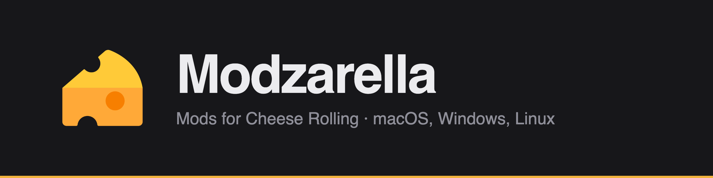
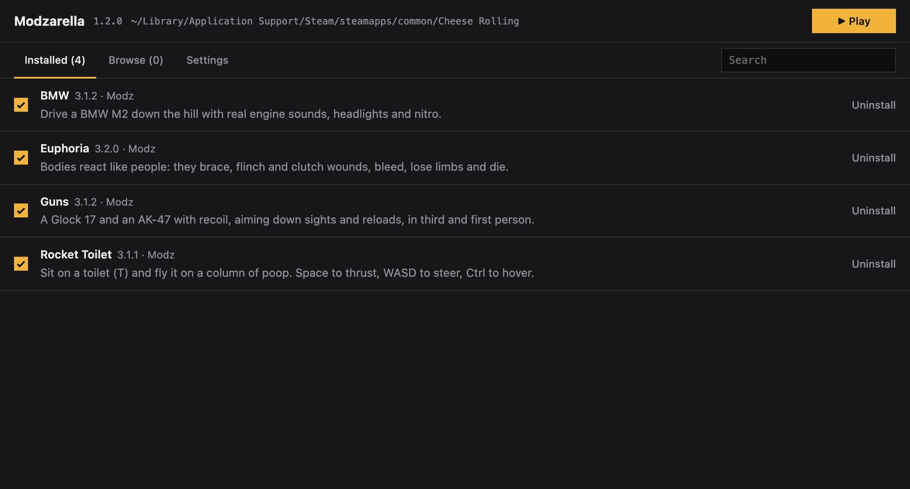
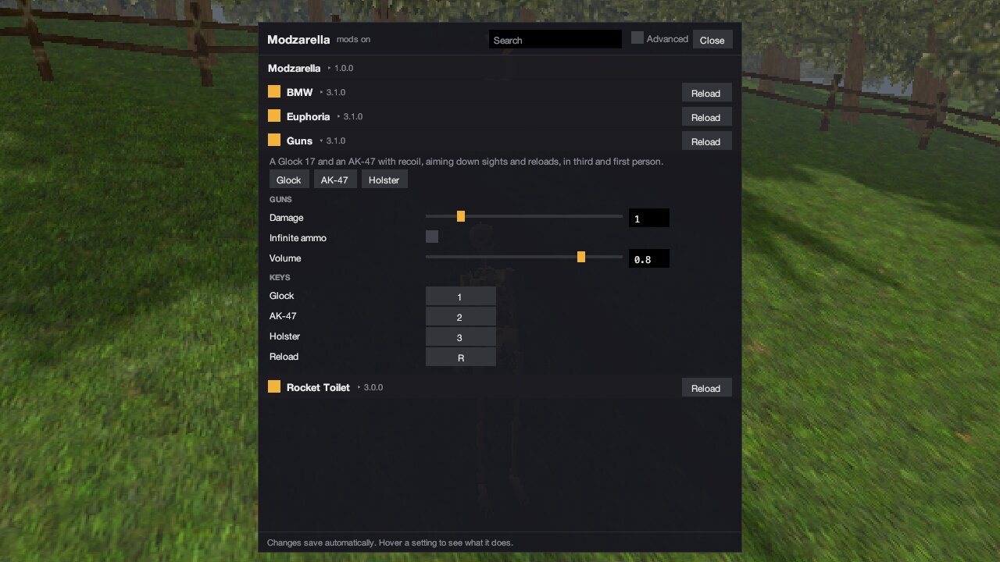
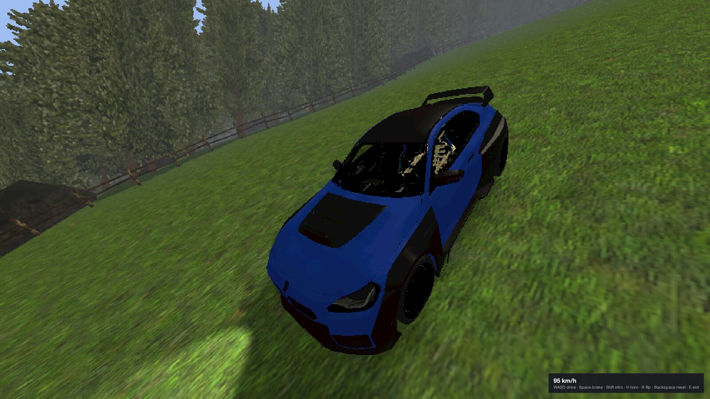
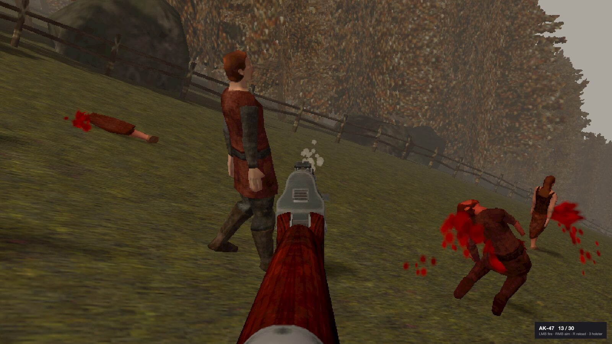
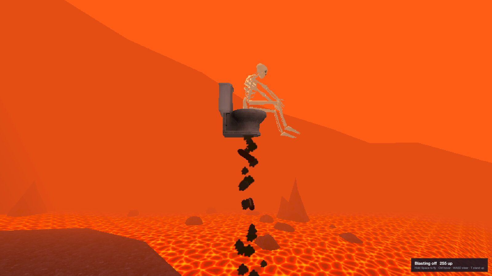
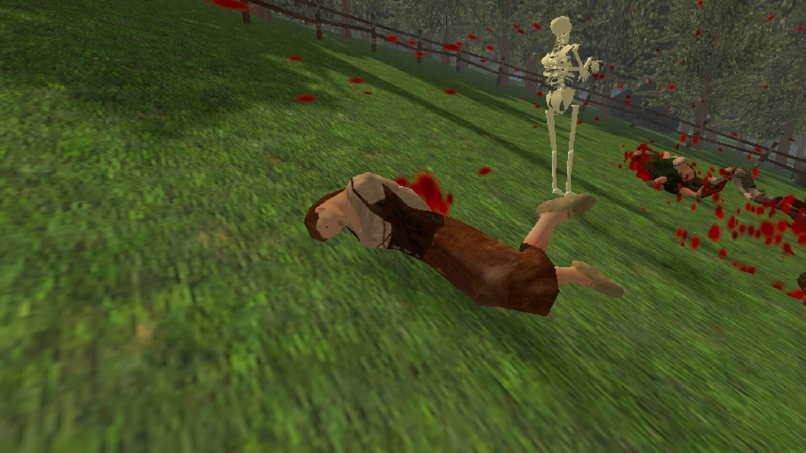

  

  <a href="https://github.com/ModzarellaHQ/Modzarella/releases/latest"><b>Download</b></a> ·
  <a href="#install">Install</a> ·
  <a href="docs/troubleshooting.md">Help</a> ·
  <a href="https://github.com/ModzarellaHQ/Modz">Make mods</a> ·
  <a href="https://modzarella.dev">Website</a>

  
  
  
  

Modzarella is a mod manager for [Cheese Rolling](https://store.steampowered.com/app/3809440/). Pick your mods, press Play, and you're in.

  
  

  
  
  
  

## Features

- **One-click setup:** finds the game and installs the mod loader for you
- **Mod browser:** turn mods on and off, update or uninstall them with one click
- **In-game menu:** press **F1** to tweak every mod's settings and keys while playing
- **Built-in extras:** freecam, mouse look, first person, zoom, endless rounds, frozen bots and slow motion
- **Lua mods:** mods are plain Lua scripts, so making one needs no compiler
- **Safe installs:** every download is checked before it touches your game
- **Cross-platform:** native app for macOS, Windows and Linux

## Install

Download the file for your system from the [latest release](https://github.com/ModzarellaHQ/Modzarella/releases/latest).

| System | Download | First launch |
|---|---|---|
| **macOS** (Apple Silicon) | `Modzarella-mac-apple-silicon.zip` | Unzip, move to Applications. If it's blocked: **System Settings → Privacy & Security → Open Anyway** |
| **macOS** (Intel) | `Modzarella-mac-intel.zip` | Same as above |
| **Windows** 10 / 11 | `Modzarella-windows.exe` | If SmartScreen appears: **More info → Run anyway** |
| **Linux** | `Modzarella-linux.tar.gz` | Extract and run `./Modzarella`. See [Linux setup](docs/troubleshooting.md#linux) |

You need Cheese Rolling from Steam, launched at least once.

## Usage

1. Open Modzarella and switch on the mods you want.
2. Press **Play**.
3. In game, choose **Play Offline** and press **F1** for the mod menu.

Mods only run offline. To play without them, start the game from Steam as usual.

## Help

Something not working? See [Troubleshooting](docs/troubleshooting.md), or [open an issue](https://github.com/ModzarellaHQ/Modzarella/issues/new/choose).

## Contributing

- **Mods** live in [Modz](https://github.com/ModzarellaHQ/Modz). Start with the [Lua API](docs/lua-api.md).
- **The app:** see [CONTRIBUTING.md](CONTRIBUTING.md) and [Building](docs/building.md).

## License

[MIT](LICENSE). Modzarella is a community project and isn't affiliated with the developers of Cheese Rolling.
