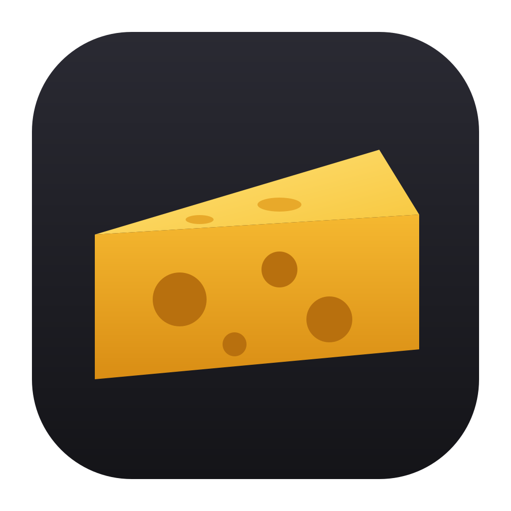

<p align="center"></p>

<h1 align="center">Modzarella</h1>

<p align="center">
  The mod manager for <a href="https://store.steampowered.com/app/3809440/">Cheese Rolling</a>.<br>
  Install mods with one click and play. Works on macOS, Windows and Linux.<br>
  <a href="https://modzarella.dev">modzarella.dev</a>
</p>

---

## Contents

- [Download](#download)
- [Install](#install)
- [Playing with mods](#playing-with-mods)
- [In-game controls](#in-game-controls)
- [Managing mods](#managing-mods)
- [Troubleshooting](#troubleshooting)
- [FAQ](#faq)
- [For developers](#for-developers)

---

## Download

Get the latest version from the **[Releases page](https://github.com/ModzarellaHQ/Modzarella/releases/latest)**.

| Your computer | Download |
|---|---|
| Mac with Apple Silicon (M1 or newer) | `Modzarella-mac-apple-silicon.zip` |
| Mac with Intel | `Modzarella-mac-intel.zip` |
| Windows 10 / 11 | `Modzarella-windows.exe` |
| Linux | `Modzarella-linux.tar.gz` |

To check which Mac you have, click the Apple menu and choose **About This Mac**. Look at **Chip**: "Apple M…" means Apple Silicon, and "Intel" means Intel.

**Before you start:** you need Cheese Rolling installed through Steam. Launch it normally at least once.

---

## Install

### macOS

1. Open the downloaded `.zip`. You'll get **Modzarella.app**.
2. Drag **Modzarella.app** into your **Applications** folder.
3. Open it.
4. If macOS says it can't be opened:
   1. Open **System Settings → Privacy & Security**.
   2. Scroll down and click **Open Anyway** next to Modzarella.
   3. Confirm.

   You only need to do this once. It happens because the app isn't signed with a paid Apple developer account.

### Windows

1. Run `Modzarella-windows.exe`. You can keep it anywhere, for example on your Desktop.
2. If **Windows protected your PC** appears, click **More info → Run anyway**. You only need to do this once.

### Linux

1. Extract the archive: `tar -xzf Modzarella-linux.tar.gz`
2. Run `./Modzarella`.
3. If no window opens, install WebKitGTK:

   | Distro | Command |
   |---|---|
   | Debian / Ubuntu | `sudo apt install libwebkit2gtk-4.1-0` |
   | Fedora | `sudo dnf install webkit2gtk4.1` |
   | Arch | `sudo pacman -S webkit2gtk-4.1` |

4. Cheese Rolling runs through Proton, so set this once in Steam. Right-click **Cheese Rolling → Properties → Launch Options** and paste:

   ```
   WINEDLLOVERRIDES="winhttp=n,b" %command%
   ```

---

## Playing with mods

1. Open **Modzarella**. It finds Cheese Rolling automatically.
2. Turn on the mods you want with their switches.
3. Click **Play**. The first time, Modzarella also installs the mod loader ([BepInEx](https://github.com/BepInEx/BepInEx)). This takes a few seconds.
4. In the game, choose **Play Offline**. Mods are switched off in online matches.
5. Press **F1** to open the mod menu.

On a Mac, Steam has to be running. If it isn't, Modzarella starts it for you; click **Play** again once Steam is open.

---

## In-game controls

Press **F1** to open the mod menu. From there you can:
- Turn each mod on or off.
- Change its settings.
- Rebind its keys.

All changes save automatically.

| Mod | Keys |
|---|---|
| **Core** (always on) | `F1` mod menu · `F3` free mouse camera · `V` first person · mouse wheel zoom |
| **BMW** | `E` get in or out · `WASD` drive · `Space` brake · `Shift` nitro · `H` horn · `R` flip · `Backspace` reset |
| **Guns** | `1` Glock · `2` AK-47 · `3` holster · `Left click` fire · `Right click` aim · `R` reload |
| **Rocket Toilet** | `T` sit or stand · hold `Space` to fly · `Ctrl` hover · `WASD` steer |
| **Game Tweaks** | `F2` endless round · `F4` freeze bots · `F5` slow motion |
| **Gore**, **Euphoria** | Nothing to press. They react to what happens. |

---

## Managing mods

| To… | Do this |
|---|---|
| Install a mod | Flip its switch on. |
| Turn a mod off without deleting it | Flip its switch off. |
| Delete a mod | Click **Uninstall** under it. |
| Update mods | Click **Update all** at the top. It only shows when an update is available. |
| Remove everything | **Settings → Remove all mods**. This restores the unmodded game. |

**Core** is needed by every other mod, so it can't be switched off. To play without mods, launch Cheese Rolling from Steam as usual.

---

## Troubleshooting

<details>
<summary><b>"Cheese Rolling wasn't found"</b></summary>

Open **Settings** and paste the game folder into **Game folder**. Usual locations:

- macOS: `~/Library/Application Support/Steam/steamapps/common/Cheese Rolling`
- Windows: `C:\Program Files (x86)\Steam\steamapps\common\Cheese Rolling`
- Linux: `~/.local/share/Steam/steamapps/common/Cheese Rolling`

In Steam you can find it with **right-click the game → Manage → Browse local files**.
</details>

<details>
<summary><b>The game starts but there are no mods</b></summary>

- Start the game from **Modzarella** (or its Play button), not from Steam. Windows is the exception: launching from Steam works there too.
- Choose **Play Offline**. Mods don't run online.
- Click **Settings → Repair mod loader**, then try again.
- Linux: check the Launch Options line in [Install → Linux](#linux).
</details>

<details>
<summary><b>The game won't start on Mac</b></summary>

Steam has to be fully open and logged in first. Wait until the Steam window has loaded, then click **Play** again.
</details>

<details>
<summary><b>The game crashes or acts strangely after an update</b></summary>

Turn mods off one at a time in Modzarella to find the cause. If nothing helps, use **Settings → Remove all mods** and reinstall them. Then [open an issue](https://github.com/ModzarellaHQ/Modzarella/issues) and attach the file `BepInEx/LogOutput.log` from your game folder.
</details>

<details>
<summary><b>"Can't read the mod source"</b></summary>

Check your internet connection. If you changed **Settings → Mod source**, set it back to the default.
</details>

---

## FAQ

**Is it safe?**
Mods only change your local copy of the game and only run in Play Offline. Modzarella downloads mods from the [Modz](https://github.com/ModzarellaHQ/Modz) catalog and verifies each file against its checksum before installing it.

**Can I get banned?**
Mods are disabled in online play, and Modzarella never touches online matches.

**How do I uninstall Modzarella?**
1. Click **Settings → Remove all mods**.
2. Delete the app.
3. Optionally, delete its settings folder:
   - macOS: `~/Library/Application Support/Modzarella`
   - Windows: `%APPDATA%\Modzarella`
   - Linux: `~/.config/Modzarella`

**Can I make my own mods?**
Yes. See [Modz](https://github.com/ModzarellaHQ/Modz).

---

## For developers

### Command line

Modzarella also works from a terminal:

| Command | What it does |
|---|---|
| `Modzarella status` | Game folder, loader and mod source |
| `Modzarella list` | Every mod and its state |
| `Modzarella install [ids…]` | Install mods (all of them if no ids) and the loader if missing |
| `Modzarella remove <ids…>` | Uninstall mods |
| `Modzarella enable <ids…>` / `disable <ids…>` | Turn installed mods on or off |
| `Modzarella update` | Update installed mods |
| `Modzarella loader` / `unloader` | Install or remove BepInEx and all mods |
| `Modzarella launch` | Start the game with mods |
| `Modzarella source [url\|folder]` | Show or set the mod source |
| `Modzarella game [folder]` | Show or set the game folder |

On macOS the binary is `Modzarella.app/Contents/MacOS/Modzarella`.

### Where things go

| What | Where |
|---|---|
| Installed mods | `<game>/BepInEx/plugins/Modz/<id>/` |
| Disabled mods | `<game>/BepInEx/plugins-disabled/Modz/<id>/` |
| Mod settings | `<game>/BepInEx/config/modz.<id>.cfg` |
| Modzarella settings | `settings.json` in the settings folder listed in the [FAQ](#faq) |

### Mod source

The mod source can be any URL or folder that contains an `index.json`. To test your own mods, point it at your clone of [Modz](https://github.com/ModzarellaHQ/Modz):

```sh
python3 .github/index.py           # in the Modz folder: builds index.json
Modzarella source ~/code/Modz
```

### Build

You need the [.NET 10 SDK](https://dotnet.microsoft.com/download).

```sh
dotnet run --project src           # run from source
./package.sh osx-arm64             # or osx-x64, win-x64, linux-x64; output goes to dist/
```

Pushing a tag like `v1.0.0` builds every platform and publishes a GitHub release.

### Project layout

```
src/        the app: Program (window), Cli, Web (local API for the UI), ui.html,
            Game (finding and launching), Loader (BepInEx), Catalog (mods), Settings
assets/     app icon
package.sh  builds the per-platform downloads
```

---

## License

MIT
